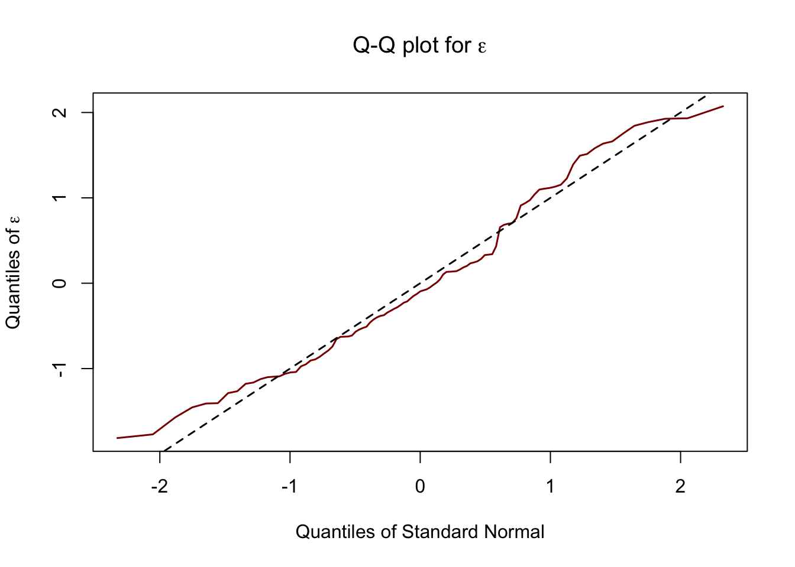
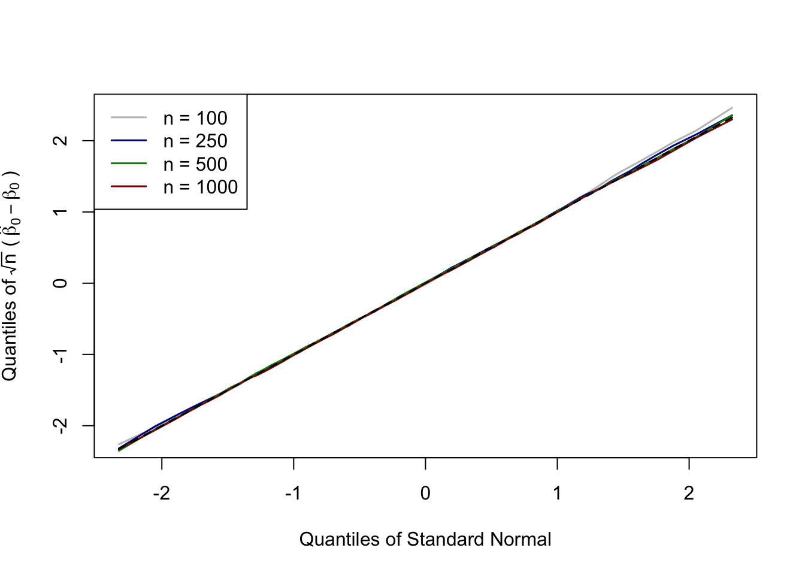
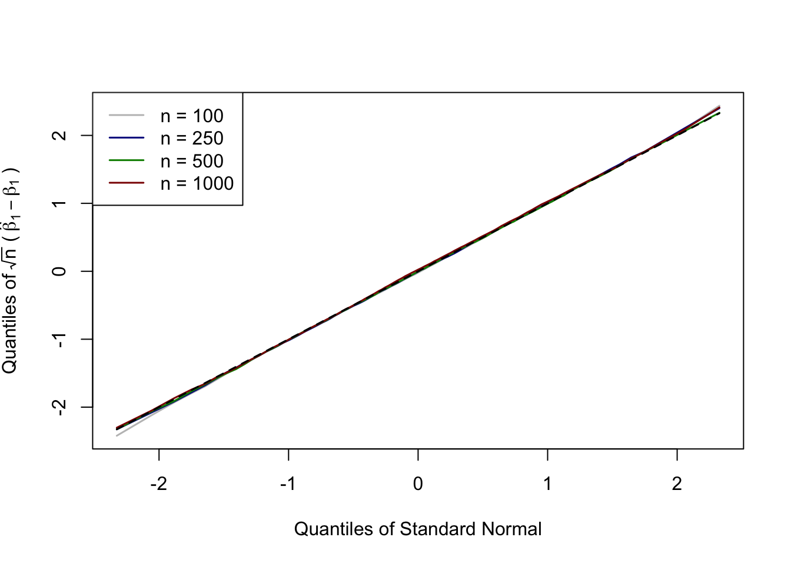

## The linear model

Consider the following linear model

$$
Y = X\beta + \varepsilon,
$$ {#eq-eq:linmodel}

where $X$ is an observed $p$-dimensional random vector of explanatory variables, which includes a constant term, $\varepsilon$ is an unobserved random disturbance term and $Y \in \mathbb{R}$ is a continuous response variable.

The model in @eq-eq:linmodel does not provide any information about the distribution of $(X,\varepsilon)$. It is a simple statistical model that postulates a linear relationship between $Y$ and $X$.

There are several separate issues about this model

1.  **Identification**: does the parameter of interest can be identified from data? The answer to this question usually requires the following conditions:


```{=html}
<!-- -->
```


a.  $E(\varepsilon) = 0$
b.  $Cov(X,\varepsilon) = 0$
c.  $E \left[ X^\prime X \right]$ exists and is not singular
d.  $E \left[ Y^2\right]$ exists

where conditions a) and b) imply that the residuals are centered, and uncorrelated with $X$; and c) and d) require the existence of the second moments of the distribution of $X$ and $Y$. In the context of time series, these assumptions are satisfies if the distribution of $(Y,X)$ is covariance stationary (otherwise those moments would not exist, see @hayashi2001, Ch 1 for a review of the plausibility of these assumptions for time series data).[^1] Under these assumptions, we can recover the *estimand* of $\beta$ as follows (see @stock_watson_2024, and @wooldridge_2008)

[^1]: Ch. 1 can also be downloaded [here](https://daniellecarusi.wordpress.com/wp-content/uploads/2009/07/s6946.pdf).

$$
\begin{aligned}
X^\prime Y =& X^\prime X \beta + X^\prime \varepsilon\\
E\left[ X^\prime Y\right] =& E\left[ X^\prime X\right] \beta + \underbrace{E \left[ X^\prime \varepsilon \right]}_{= 0} \\
\beta =& \left( E\left[ X^\prime X\right] \right)^{-1} E\left[ X^\prime Y\right].
\end{aligned}
$$

2.  **Estimation**: how can we construct an estimator of $\beta$? Given data from the joint distribution of $(Y,X)$, $\left\lbrace (Y_i,X_i), i = 1,\dots,n \right\rbrace$, we can replace the population moments above with sample moments. Here, I use $n$ to denote the sample size, but this notation does not imply any specific assumptions on the nature of the data (e.g., it could be a time series). Let

$$
\mathbf{Y}= \begin{bmatrix} Y_1 \\ \vdots \\ Y_n \end{bmatrix}, \quad \mathbf{X}= \begin{bmatrix} X_1 \\ \vdots \\ X_n \end{bmatrix},
$$ we can construct the sample moments $\mathbf{X}^\prime \mathbf{Y}/n$ and $\mathbf{X}^\prime \mathbf{X}/n$, so that our estimator of $\beta$ is given by

$$
\hat\beta = \left( \mathbf{X}^\prime \mathbf{X} \right)^{-1}\mathbf{X}^\prime \mathbf{Y}.
$$ {#eq-eq:olsest}

There are a variety of theorems that allow us to prove that this estimator converges to the true value of $\beta$ as the sample size increases (this is called the law of large numbers, LLN). It suffices to say that there are versions of the LLN that apply to independent, identically distributed data (IID realizations from the distribution of $(Y,X)$); independent and non-identically distributed data (INID); and also to dependent data (for instance, to time-series, thanks to the ergodic theorem; see @hayashi2001, Ch. 1 and 9). Most of these theorems do not require further conditions than those outlined above (existence of certain moments of the distribution of $(Y,X)$).

3.  **Inference**: how do we assess the variability of our estimator, test specific hypotheses and/or construct prediction intervals? We usually need to have a way to show that the distribution of the estimator around the true value of $\beta$ (which exists under the conditions in 1), is well behaved (i.e., targets the correct population parameter and has finite variance). There are two types of results that one can be interested in

    a.  **Finite sample properties**: when $n$ is relatively small, we could be interested in assumptions that would allow us to derive the distribution of the estimator. Such assumptions usually restrict the distribution of $\varepsilon$. In particular, one can have that $\varepsilon_i \sim N(0, \sigma^2)$. This assumption implies full independence between the regressors $X$, and the error term. It also entails *homoskedasticity* of the error term (i.e., the variance is the same irrespectively of the value of $X$).

    b.  **Large sample properties**: when $n$ is large, we do not require any assumptions about the distribution of $\varepsilon$. Addional requirements include that the fourth moments of the distribution of $Y$ and $X$ exist (see @stock_watson_2024, Chapter 3). The Central Limit Theorem (CLT) allows us to prove that, with minimal assumptions on the Data Generating Process (DGP), the distribution of the OLS estimator in @eq-eq:olsest converges to a normal distribution.

In the era of *big data*, results in $a$ may not be very relevant. In the next section I show that the normal approximations in $b$ hold even with as few as $100$ data points, so that, in my opinion, in many practical applications (and when the model is correctly specified) we should not take a finite-sample approach.

There are also other considerations that we may want to make. For instance, one may be concerned with the **efficiency** of the estimator (i.e., obtaining the estimator with the smallest possible variance). The Gauss-Markov theorem shows that the OLS estimator is the most efficient when the error term is homoskedastic (i.e. the variance of $\varepsilon$ does not depend on $X$). This is a statement about the second moment of the distribution of $\hat{\beta}$, and not about its distribution. So the Gauss-Markov theorem (which is still a very important result in statistics and very useful to understand the concept of efficiency) does not require assumptions about the distribution of $\varepsilon$ to hold. Moreover, even if the OLS may not be the most efficient when homoskedasticity is violated, it is still consistent. One just needs to be careful about the way its standard errors are being estimated. But this is very different from saying that the linear model does not work when the error term is not normal and when is heteroskedasticity or autocorrelation in the residuals. We just need to modify its standard error (i.e. the way we measure the uncertainty of that estimator) to take that feature into account.

Where is the confusion coming from in my opinion?

1.  **Misunderstanding the results of the CLT.** A common myth is that if the distribution of the estimator is normal, then the underlying distribution of the data must be normal as well. This is **false**. As long as certain moments of the underlying distribution of the data exist, the estimators we use (and in particular, the OLS estimator in @eq-eq:olsest) are constructed using averages. These averages are well-behaved so that, when the sample size is sufficiently large, the uncertainty can be characterized by a normal distribution. These approximation do not work when certain moments of the distribution of the data do not exist (i.e., Cauchy).

2.  **Gaussian implies linear, and linear implies Gaussian.** It is true that if the joint distribution of $(Y,X)$ is jointly normal than the conditional expectation of $Y$ given $X$ is a linear function of $X$, and that $Y$ can be characterized by the sum of its conditional expectation (a liner function of $X$) plus a normal random variable which is independent of $X$ (basically a linear model). But then the second implication is not necessarily true. We can construct a DGP in which the conditional expectation of $Y$ given $X$ is linear, even if the joint distribution is not a normal distribution (see below). Moreover, there is an important distinction between a model linear in $X$ and a model that is linear in $\beta$. We can still include nonlinearities in the latter by introducing polynomial terms or monotone transformations of $X$. So the use case of a model linear in parameter is not confined to the Gaussian world.

## Simulations

We first load the R libraries that we require for this simple exercise.


::: {.cell}

```{.r .cell-code}
library(knitr)
library(ggplot2)
library(sandwich)
```
:::


In particular, the R library `sandwich` allows us to construct several estimators of the standard errors that are robust to heteroskedasticity and autocorrelation in the residuals (see, e.g., @white_1980 and @newey_west_1987).

Throughout this session, we fix the sample size to a grid of point $n= \lbrace 100,250,500,1000 \rbrace$ to assess how the properties of our estimator improve as we increase the sample size. Also, our goal is to show that the distribution of the estimator in finite but large samples is approximately normal.

### Regression model with IID data when the error term is non-normally distributed.

Let us fix the sample size to $100$, and consider the following DGP


::: {.cell}

```{.r .cell-code}
set.seed(42)

meaneps <- 0.75*sqrt(2/pi)
vareps <- 0.25^2 +  (0.75^2)*(1 - 2/pi)
        
dgp_fun_1 <- function(n){
  
        epsilon <- 0.25*rnorm(n) + 0.75*abs(rnorm(n))
        
        x <- runif(n)
        
        y <- 1 + x + (epsilon - meaneps)
        
        return(data.frame(y = y, x = x, error = epsilon - mean(epsilon)))
}

data_ex_1 <- dgp_fun_1(100)

error_std <- data_ex_1$error/sd(data_ex_1$error)
```
:::

::: {.cell}
::: {.cell-output-display}
{#fig-sim_dgp_1 width=672}
:::
:::


In this case the error term as as skew-normal distribution (a linear combination between a normal random variable and a half-normal random variable, see @azzalini_2013), which is clearly asymmetric, as shown in @fig-sim_dgp_1. In @tbl-regresults_sim_1, we report the results for the estimation with one random sample, where we also report the $95\%$ confidence interval.


::: {#tbl-regresults_sim_1 .cell}
::: {.cell-output-display}


Table: Results for a randomly selected sample of $n = 100$ observations.

|                | Estimate| Std. Error| CI(95%) LB| CI(95%) UB|
|:---------------|--------:|----------:|----------:|----------:|
|$\hat{\beta}_0$ |    0.926|      0.084|      0.760|      1.093|
|$\hat{\beta}_1$ |    1.031|      0.154|      0.726|      1.337|


:::
:::


The coefficients have the expected sign and magnitude, and the $95\%$ confidence intervals cover the true value of the parameter. In R, the standard errors with the default `lm` command are computed under the assumption of homoskedasticity, which we know is satisfied in this case as the error term is fully independent of $X$.

Let us now run a large scale simulation exercise with $R = 10000$ replications for increasing sample size. The goal of this exercise is to show that:

1.  The coefficients converge to their true value as the sample size increase.
2.  The distribution of the coefficients is approximately normal, and the approximation improves as the sample size increases, even if the distribution of the error term is not normal.


::: {.cell}

:::


I produce the qq-plots of the distribution of $\hat{\beta} - \beta$ normalized by its standard error, which theoretically is equal to the square-root of the diagonal of this matrix

$$
\sigma^2 \left[ E \begin{pmatrix} 1 & X \\ X & X^2 \end{pmatrix}\right]^{-1} = \sigma^2\left[ \begin{pmatrix} 1 & 1/2 \\ 1/2 & 1/3 \end{pmatrix}\right]^{-1} = \sigma^2 \begin{pmatrix} 4 & -6 \\ -6 & 12 \end{pmatrix}, 
$$ where $\sigma^2 = 0.267$.


::: {#fig-sim_dgp_1_coef .cell layout-ncol="2"}
::: {.cell-output-display}
{#fig-sim_dgp_1_coef-1 width=672}
:::

::: {.cell-output-display}
{#fig-sim_dgp_1_coef-2 width=672}
:::

QQ-plot of the regression coefficients for different sample sizes.
:::


In @fig-sim_dgp_1_coef the lines are indistinguishable, showing that the normal approximation works well for sample sizes as small as $n = 100$.

**Take home message 1**: the linear model can be used even when the error is not normally distributed, as the OLS estimator preserves its good large-sample properties, and it is still the most efficient because of the Gauss-Markov theorem.

### Regression model with IID data when the error term is non-normally distributed and heteroskedastic

Let us consider the same example as before, and let us now add heteroskedasticity of the error term though an exponential function, with $n = 100$.


::: {.cell}

```{.r .cell-code}
set.seed(42)

meaneps <- 0.75*sqrt(2/pi)
vareps <- 0.25^2 +  (0.75^2)*(1 - 2/pi)
        
dgp_fun_2 <- function(n){
  
        epsilon <- 0.25*rnorm(n) + 0.75*abs(rnorm(n))
        
        x <- runif(n)
        
        y <- 1 + x + exp(-x)*(epsilon - meaneps)
        
        return(data.frame(y = y, x = x, error = epsilon - mean(epsilon)))
}

data_ex_2 <- dgp_fun_2(100)
```
:::

::: {#tbl-regresults_sim_2 .cell}
::: {.cell-output-display}


Table: Results for a randomly selected sample of $n = 100$ observations.

|                | Estimate| Std. Error| CI(95%) LB| CI(95%) UB|
|:---------------|--------:|----------:|----------:|----------:|
|$\hat{\beta}_0$ |    1.242|      0.084|      1.076|      1.408|
|$\hat{\beta}_1$ |    0.649|      0.137|      0.377|      0.921|


:::
:::


The results in @tbl-regresults_sim_2 seems very consistent with our results above: The estimator is still very close to the true value, which is not surprising, because heteroskedasticity does not affect our ability to estimate $\beta$, and true value of the parameter is still within the $95\%$ confidence interval. However, the standard errors are not correct here, because they ignore heteroskedasticity, which affects our confidence intervals, and therefore our ability to correctly assess the uncertainty of our point estimate.

With the package `sandwich` in R, we can compute standard errors that are robust to heteroskedasticity of various form


::: {.cell}

:::


The `type` argument specifies the type of heteroskedasticity-robust correction we want to apply. Here, we apply the `HC1` variant, which is close to what one gets in Stata with the option `robust` for the linear regression model. There are several variations of the `type` argument, and I suggest to take a look at the help file in the `sandwich` package and references therein.

We modify the standard errors and confidence intervals in the previous tables, using now their heteroskedasticity-robust version. Results are reported in @tbl-regresults_sim_2_het.


::: {#tbl-regresults_sim_2_het .cell}
::: {.cell-output-display}


Table: Results for a randomly selected sample of $n = 100$ observations with heteroskedasticity robust standard errors.

|                | Estimate| Std. Error| CI(95%) LB| CI(95%) UB|
|:---------------|--------:|----------:|----------:|----------:|
|$\hat{\beta}_0$ |    1.242|      0.122|      1.004|      1.481|
|$\hat{\beta}_1$ |    0.649|      0.169|      0.317|      0.981|


:::
:::


We notice how the standard errors are now substantially larger than before, so that our $95\%$ confidence interval with homoskedasticity can undercover (sometimes severely) the distribution of $\beta$. To quantity the undercoverage, we consider a large-scale simulation, in which the nominal coverage of the confidence intervals is compared with the coverage we obtain with and without the correction for heteroskedasticity.


::: {.cell}

:::

::: {#tbl-covresults_sim_2 .cell}
::: {.cell-output-display}

`````{=html}
<table>
<caption>Coverage rates with different estimates for standard errors.</caption>
 <thead>
<tr>
<th style="empty-cells: hide;border-bottom:hidden;" colspan="1"></th>
<th style="border-bottom:hidden;padding-bottom:0; padding-left:3px;padding-right:3px;text-align: center; " colspan="3"><div style="border-bottom: 1px solid #ddd; padding-bottom: 5px; ">Homoskedastic</div></th>
<th style="border-bottom:hidden;padding-bottom:0; padding-left:3px;padding-right:3px;text-align: center; " colspan="3"><div style="border-bottom: 1px solid #ddd; padding-bottom: 5px; ">Heteroskedastic</div></th>
</tr>
  <tr>
   <th style="text-align:left;">  </th>
   <th style="text-align:left;"> 90% </th>
   <th style="text-align:left;"> 95% </th>
   <th style="text-align:left;"> 99% </th>
   <th style="text-align:left;"> 90% </th>
   <th style="text-align:left;"> 95% </th>
   <th style="text-align:left;"> 99% </th>
  </tr>
 </thead>
<tbody>
  <tr>
   <td style="text-align:left;border-bottom: 1px solid"> \(\mathbf{\hat{\beta}_0}\) </td>
   <td style="text-align:left;border-bottom: 1px solid">  </td>
   <td style="text-align:left;border-bottom: 1px solid">  </td>
   <td style="text-align:left;border-bottom: 1px solid">  </td>
   <td style="text-align:left;border-bottom: 1px solid">  </td>
   <td style="text-align:left;border-bottom: 1px solid">  </td>
   <td style="text-align:left;border-bottom: 1px solid">  </td>
  </tr>
  <tr>
   <td style="text-align:left;"> n = 100 </td>
   <td style="text-align:left;"> 0.815 </td>
   <td style="text-align:left;"> 0.886 </td>
   <td style="text-align:left;"> 0.961 </td>
   <td style="text-align:left;"> 0.890 </td>
   <td style="text-align:left;"> 0.939 </td>
   <td style="text-align:left;"> 0.984 </td>
  </tr>
  <tr>
   <td style="text-align:left;"> n = 250 </td>
   <td style="text-align:left;"> 0.806 </td>
   <td style="text-align:left;"> 0.880 </td>
   <td style="text-align:left;"> 0.960 </td>
   <td style="text-align:left;"> 0.892 </td>
   <td style="text-align:left;"> 0.946 </td>
   <td style="text-align:left;"> 0.988 </td>
  </tr>
  <tr>
   <td style="text-align:left;"> n = 500 </td>
   <td style="text-align:left;"> 0.817 </td>
   <td style="text-align:left;"> 0.888 </td>
   <td style="text-align:left;"> 0.962 </td>
   <td style="text-align:left;"> 0.900 </td>
   <td style="text-align:left;"> 0.948 </td>
   <td style="text-align:left;"> 0.990 </td>
  </tr>
  <tr>
   <td style="text-align:left;"> n = 1000 </td>
   <td style="text-align:left;"> 0.807 </td>
   <td style="text-align:left;"> 0.879 </td>
   <td style="text-align:left;"> 0.959 </td>
   <td style="text-align:left;"> 0.896 </td>
   <td style="text-align:left;"> 0.947 </td>
   <td style="text-align:left;"> 0.988 </td>
  </tr>
  <tr>
   <td style="text-align:left;border-bottom: 1px solid"> \(\mathbf{\hat{\beta}_1}\) </td>
   <td style="text-align:left;border-bottom: 1px solid">  </td>
   <td style="text-align:left;border-bottom: 1px solid">  </td>
   <td style="text-align:left;border-bottom: 1px solid">  </td>
   <td style="text-align:left;border-bottom: 1px solid">  </td>
   <td style="text-align:left;border-bottom: 1px solid">  </td>
   <td style="text-align:left;border-bottom: 1px solid">  </td>
  </tr>
  <tr>
   <td style="text-align:left;"> n = 100 </td>
   <td style="text-align:left;"> 0.879 </td>
   <td style="text-align:left;"> 0.934 </td>
   <td style="text-align:left;"> 0.984 </td>
   <td style="text-align:left;"> 0.891 </td>
   <td style="text-align:left;"> 0.939 </td>
   <td style="text-align:left;"> 0.984 </td>
  </tr>
  <tr>
   <td style="text-align:left;"> n = 250 </td>
   <td style="text-align:left;"> 0.874 </td>
   <td style="text-align:left;"> 0.932 </td>
   <td style="text-align:left;"> 0.986 </td>
   <td style="text-align:left;"> 0.890 </td>
   <td style="text-align:left;"> 0.942 </td>
   <td style="text-align:left;"> 0.988 </td>
  </tr>
  <tr>
   <td style="text-align:left;"> n = 500 </td>
   <td style="text-align:left;"> 0.881 </td>
   <td style="text-align:left;"> 0.934 </td>
   <td style="text-align:left;"> 0.985 </td>
   <td style="text-align:left;"> 0.897 </td>
   <td style="text-align:left;"> 0.948 </td>
   <td style="text-align:left;"> 0.989 </td>
  </tr>
  <tr>
   <td style="text-align:left;"> n = 1000 </td>
   <td style="text-align:left;"> 0.874 </td>
   <td style="text-align:left;"> 0.931 </td>
   <td style="text-align:left;"> 0.983 </td>
   <td style="text-align:left;"> 0.893 </td>
   <td style="text-align:left;"> 0.944 </td>
   <td style="text-align:left;"> 0.989 </td>
  </tr>
</tbody>
</table>

`````

:::
:::


In @tbl-covresults_sim_2, the coverage of the confidence intervals that use the assumption of homoskedasticity deteriorates as the sample size increases; while those constructed using the heteroskedasticity-robust standard error preserve coverage, and coverage is very close to the nominal one for samples of modest size.

**Take home message 2**: you can still use the linear model when you have heteroskedasticity. Just make sure that you account for it when you construct your standard errors, using heteroskedasticy-robust estimate.

### Regression model with time-series data when the error term is non-normally distributed and auto-correlated

Let us consider a different data-generating process, when the error term is allowed to be autocorrelated and heteroskedastic. I don't generate autocorrelation in the regressor, but there is going to be autocorrelation in the dependent variable, because of the autocorrelation in the error term. As before, let us start with a sample of modest size $n = 100$.


::: {.cell}

```{.r .cell-code}
set.seed(42)

meaneps <- 0.75*sqrt(2/pi)
vareps <- 0.25^2 +  (0.75^2)*(1 - 2/pi)
        
dgp_fun_3 <- function(n){
  
        epsilon <- 0.25*rnorm(n) + 0.75*abs(rnorm(n))
        
        u <- integer(n)
        u[1] <- epsilon[1] - meaneps
        for(dd in 2:n){
          u[dd] <- 0.8*u[dd-1] + (epsilon[dd] - meaneps)
        }
        
        x <- runif(n)
        
        y <- 1 + x + exp(-x)*u
        
        return(data.frame(y = y, x = x, error = u))
}

data_ex_3 <- dgp_fun_3(100)
```
:::

::: {#tbl-regresults_sim_3 .cell}
::: {.cell-output-display}


Table: Results for a randomly selected sample of $n = 100$ observations.

|                | Estimate| Std. Error| CI(95%) LB| CI(95%) UB|
|:---------------|--------:|----------:|----------:|----------:|
|$\hat{\beta}_0$ |     0.93|      0.070|      0.791|      1.070|
|$\hat{\beta}_1$ |     1.00|      0.135|      0.731|      1.268|


:::
:::


The results in @tbl-regresults_sim_3 show the same pattern as before. The estimator is still very close to the true value, which should not be surprising, because heteroskedasticity and autocorrelation do not affect our ability to estimate $\beta$, although the true value of the parameter is not within the $95\%$ confidence interval. Again, the standard errors are not correct here, because they ignore both heteroskedasticity and autocorrelation.

With the package `sandwich` in R, we can compute standard errors that are robust to heteroskedasticity and autocorrelation following the approach of @newey_west_1987.


::: {.cell}

:::


There are several arguments of this function that can be tuned by the user, and you can explore those arguments by typing `?sandwich::vcovHAC` in the R console. Here, I just go with the standard setting for simplicity (but one should do due diligence when applying this to real data).

We modify the standard errors and confidence intervals in the previous tables, using now their heteroskedasticity and autocorrelation-robust version. Results are reported in @tbl-regresults_sim_3_het.


::: {#tbl-regresults_sim_3_het .cell}
::: {.cell-output-display}


Table: Results for a randomly selected sample of $n = 100$ observations with heteroskedasticity and autocorrelation robust standard errors.

|                | Estimate| Std. Error| CI(95%) LB| CI(95%) UB|
|:---------------|--------:|----------:|----------:|----------:|
|$\hat{\beta}_0$ |     0.93|      0.119|      0.697|      1.164|
|$\hat{\beta}_1$ |     1.00|      0.136|      0.733|      1.266|


:::
:::


We see the same pattern as before: our heteroskedasticity and autocorrelation robust standard errors are much larger than those considering homoskedasticity. Therefore, if we were not to use them, we would severely underestimate the uncertainty associated to our point estimate.

Let me repeat the same large-scale simulation as before, comparing the coverage rate in both cases.


::: {.cell}

:::

::: {#tbl-covresults_sim_3 .cell}
::: {.cell-output-display}

`````{=html}
<table class="table" style="margin-left: auto; margin-right: auto;">
<caption>Coverage rates with different estimates for standard errors.</caption>
 <thead>
<tr>
<th style="empty-cells: hide;border-bottom:hidden;" colspan="1"></th>
<th style="border-bottom:hidden;padding-bottom:0; padding-left:3px;padding-right:3px;text-align: center; " colspan="3"><div style="border-bottom: 1px solid #ddd; padding-bottom: 5px; ">Homoskedastic</div></th>
<th style="border-bottom:hidden;padding-bottom:0; padding-left:3px;padding-right:3px;text-align: center; " colspan="3"><div style="border-bottom: 1px solid #ddd; padding-bottom: 5px; ">Heteroskedastic and autocorrelated</div></th>
</tr>
  <tr>
   <th style="text-align:left;">  </th>
   <th style="text-align:right;"> 90% </th>
   <th style="text-align:right;"> 95% </th>
   <th style="text-align:right;"> 99% </th>
   <th style="text-align:right;"> 90% </th>
   <th style="text-align:right;"> 95% </th>
   <th style="text-align:right;"> 99% </th>
  </tr>
 </thead>
<tbody>
  <tr grouplength="4"><td colspan="7" style="border-bottom: 1px solid;"><strong>$\hat{\beta}_0$</strong></td></tr>
<tr>
   <td style="text-align:left;padding-left: 2em;" indentlevel="1"> n = 100 </td>
   <td style="text-align:right;"> 0.502 </td>
   <td style="text-align:right;"> 0.582 </td>
   <td style="text-align:right;"> 0.715 </td>
   <td style="text-align:right;"> 0.995 </td>
   <td style="text-align:right;"> 0.998 </td>
   <td style="text-align:right;"> 1.000 </td>
  </tr>
  <tr>
   <td style="text-align:left;padding-left: 2em;" indentlevel="1"> n = 250 </td>
   <td style="text-align:right;"> 0.507 </td>
   <td style="text-align:right;"> 0.585 </td>
   <td style="text-align:right;"> 0.712 </td>
   <td style="text-align:right;"> 1.000 </td>
   <td style="text-align:right;"> 1.000 </td>
   <td style="text-align:right;"> 1.000 </td>
  </tr>
  <tr>
   <td style="text-align:left;padding-left: 2em;" indentlevel="1"> n = 500 </td>
   <td style="text-align:right;"> 0.514 </td>
   <td style="text-align:right;"> 0.593 </td>
   <td style="text-align:right;"> 0.719 </td>
   <td style="text-align:right;"> 1.000 </td>
   <td style="text-align:right;"> 1.000 </td>
   <td style="text-align:right;"> 1.000 </td>
  </tr>
  <tr>
   <td style="text-align:left;padding-left: 2em;" indentlevel="1"> n = 1000 </td>
   <td style="text-align:right;"> 0.514 </td>
   <td style="text-align:right;"> 0.589 </td>
   <td style="text-align:right;"> 0.722 </td>
   <td style="text-align:right;"> 1.000 </td>
   <td style="text-align:right;"> 1.000 </td>
   <td style="text-align:right;"> 1.000 </td>
  </tr>
  <tr grouplength="4"><td colspan="7" style="border-bottom: 1px solid;"><strong>$\hat{\beta}_1$</strong></td></tr>
<tr>
   <td style="text-align:left;padding-left: 2em;" indentlevel="1"> n = 100 </td>
   <td style="text-align:right;"> 0.781 </td>
   <td style="text-align:right;"> 0.858 </td>
   <td style="text-align:right;"> 0.946 </td>
   <td style="text-align:right;"> 0.971 </td>
   <td style="text-align:right;"> 0.987 </td>
   <td style="text-align:right;"> 0.997 </td>
  </tr>
  <tr>
   <td style="text-align:left;padding-left: 2em;" indentlevel="1"> n = 250 </td>
   <td style="text-align:right;"> 0.785 </td>
   <td style="text-align:right;"> 0.861 </td>
   <td style="text-align:right;"> 0.946 </td>
   <td style="text-align:right;"> 0.991 </td>
   <td style="text-align:right;"> 0.998 </td>
   <td style="text-align:right;"> 1.000 </td>
  </tr>
  <tr>
   <td style="text-align:left;padding-left: 2em;" indentlevel="1"> n = 500 </td>
   <td style="text-align:right;"> 0.790 </td>
   <td style="text-align:right;"> 0.864 </td>
   <td style="text-align:right;"> 0.951 </td>
   <td style="text-align:right;"> 0.995 </td>
   <td style="text-align:right;"> 0.998 </td>
   <td style="text-align:right;"> 1.000 </td>
  </tr>
  <tr>
   <td style="text-align:left;padding-left: 2em;" indentlevel="1"> n = 1000 </td>
   <td style="text-align:right;"> 0.790 </td>
   <td style="text-align:right;"> 0.865 </td>
   <td style="text-align:right;"> 0.951 </td>
   <td style="text-align:right;"> 0.997 </td>
   <td style="text-align:right;"> 1.000 </td>
   <td style="text-align:right;"> 1.000 </td>
  </tr>
</tbody>
</table>

`````

:::
:::


In @tbl-covresults_sim_3, the same pattern as before emerges: the coverage of the confidence interval deteriorates as the sample size increase when we do not account for heteroskedasticity and autocorrelation in the estimation of the standard errors. In this case, with the robust standard errors, confidence intervals are too wide (they have larger length than the nominal one), so they lead us to the conservative approach of over-estimating the risk of the OLS estimator.

**Take home message 3**: you can still use the linear model when you have heteroskedasticity and autocorrelation. Just make sure that you account for it when you construct your standard errors, using heteroskedasticy and autocorrelation robust estimate.

## How to detect deviations from homoskedasticity?

How do we know what type of robust estimate to use for the standard errors? Ideally, we could plot, explore and test our data to decide. One can use the Breusch-Pagan test for heteroskedasticity and, if you have time-series, you can run autocorrelation tests on the OLS residuals (e.g., Durbin-Watson test).

You can also use the wild bootstrap to obtain a finite-sample approximation to the asymptotic distribution of your data. This procedure is robust to heteroskedasticity (@liu_1988,@davidson_2008), and modifications of it can be used for dependent data (@shao_2010).

## References
